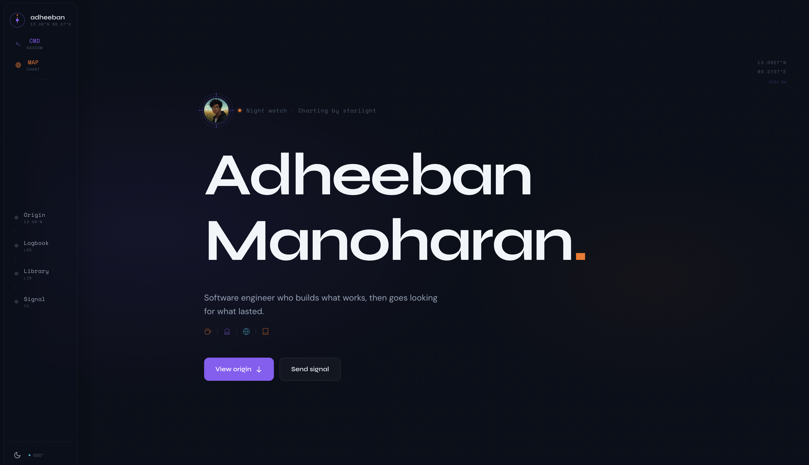
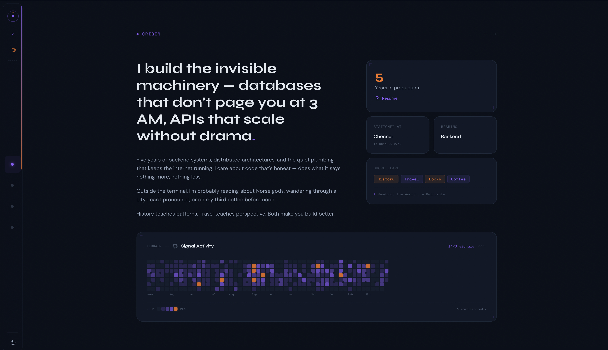
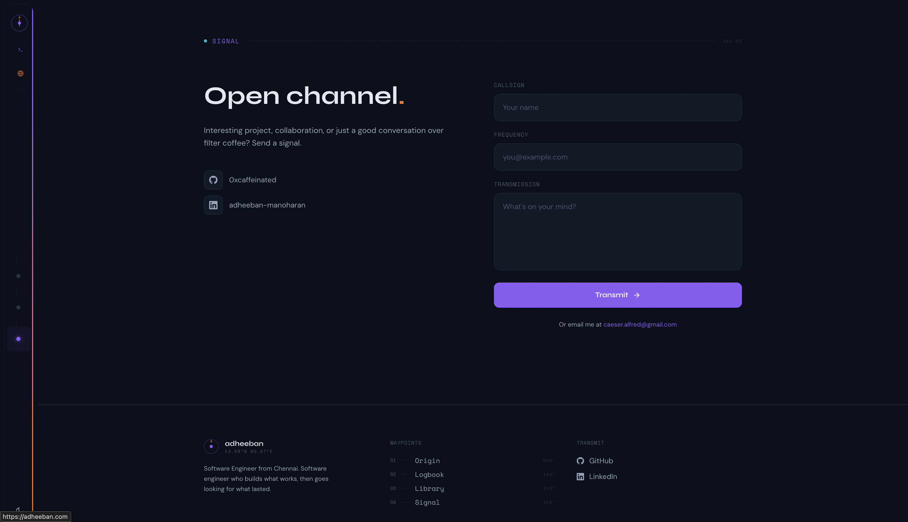
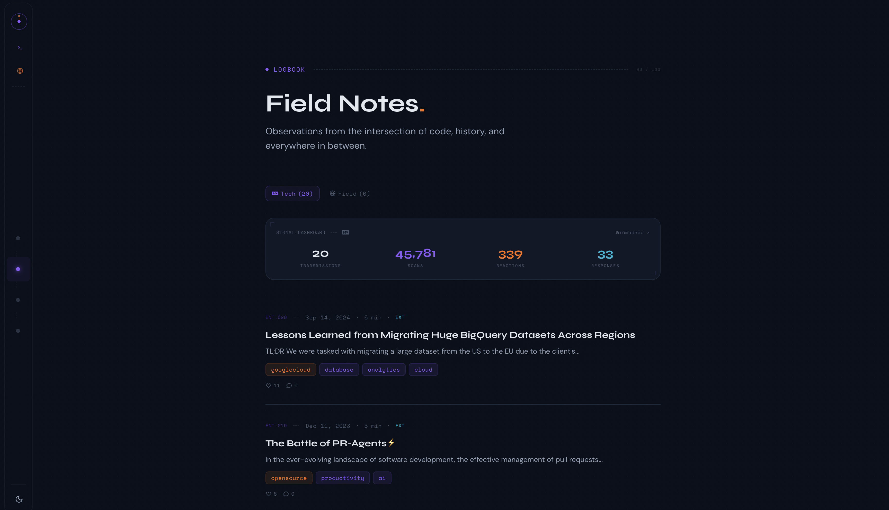

# Navigator

A developer portfolio with a navigator/cartographic theme. Compass roses, bearing badges, topographic terrain grids, a ship's logbook, and a working terminal — all configurable from a single file.

**[Live Demo](https://adheeban.com)** | Built with Astro + Tailwind CSS + GSAP

### Screenshots

| | |
|:---:|:---:|
|  |  |
| Hero | About & GitHub Terrain |
|  |  |
| Contact & Footer | Blog — Field Notes |

## Features

- **One-file setup** — edit `src/config.ts` and you're done
- **Working terminal** — type `help` to explore commands like `whoami`, `neofetch`, `man`, `terrain`
- **Interactive map** — Leaflet.js map with your travel waypoints and route lines
- **GitHub terrain map** — contribution heatmap styled as topographic contour lines
- **Dev.to integration** — client-side paginated articles + build-time stats dashboard
- **Blog + Books** — MDX-powered local posts and a reading list
- **Dark / light mode** — full CSS variable theming, no flash on load
- **Scroll animations** — GSAP reveals, magnetic buttons, 3D card tilt, smooth scroll
- **Contact form** — Web3Forms (free, no backend)
- **SEO ready** — canonical URLs, Open Graph, Twitter cards, JSON-LD, sitemap
- **Accessible** — `prefers-reduced-motion` respected, skip-to-content link
- **Responsive** — collapsible sidebar on desktop, bottom bar on mobile

## Quick Start

```sh
git clone https://github.com/0xcaffeinated/navigator.git
cd navigator
npm install
npm run dev        # → http://localhost:4321
```

Requires **Node >= 22.12.0**.

## Make It Yours

### 1. Edit `src/config.ts`

This is the only file you need to touch. Every personal detail lives here:

```ts
export const siteConfig = {
  name: { first: 'Your', last: 'Name', full: 'Your Name', short: 'yourname' },
  role: 'Software Engineer',
  specialty: 'Backend / Systems',
  tagline: 'Your one-liner tagline.',
  careerStart: '2021-06-21',           // auto-calculates years of experience
  location: {
    city: 'Tokyo', country: 'Japan', countryCode: 'JP',
    lat: 35.6762, lon: 139.6503,       // used for coordinates display + map
  },
  siteUrl: 'https://yourdomain.com',
  social: {
    github:       { username: 'you', url: 'https://github.com/you' },
    linkedin:     { username: 'you', url: 'https://linkedin.com/in/you' },
    devto:        { username: 'you', url: 'https://dev.to/you' },
    buymeacoffee: { username: 'you', url: 'https://buymeacoffee.com/you' },
  },
  email: 'you@example.com',
  web3formsKey: 'your-key',            // free at https://web3forms.com

  about: {
    headline: "Your headline here",
    paragraphs: ["First paragraph.", "Second paragraph."],
    interests: ['Travel', 'Coffee'],
    reading: 'Book Title — Author',
  },

  places: [                            // shown on the interactive map
    { name: 'Tokyo', lat: 35.68, lon: 139.65, home: true },
    { name: 'Kyoto', lat: 35.01, lon: 135.77, home: false },
  ],

  man: {                               // terminal `man` command output
    name: 'your tagline here',
    flags: '[--coffee] [--backend]',
    description: ["Line one.", "Line two."],
    offDuty: ["What you do outside work."],
  },
};
```

### 2. Replace assets

| File | What | Size |
|:-----|:-----|:-----|
| `public/og-image.png` | Social share image | 1200 x 630 |
| `public/favicon.svg` | Vector favicon | any |
| `public/favicon.ico` | Fallback favicon | 32 x 32 |
| `public/robots.txt` | Update `Sitemap:` URL with your domain | — |
| `public/resume.pdf` | Optional — linked from terminal `cat resume.txt` | — |

### 3. Add content

**Blog posts** — add `.md` or `.mdx` files to `src/content/blog/`:

```md
---
title: My First Post
description: A short summary.
date: 2025-01-15
tags: [go, backend]
---

Your content here.
```

**Books** — add `.md` files to `src/content/books/`:

```md
---
title: Book Title
description: What it's about.
status: writing    # writing | planned | published
genre: non-fiction
progress: 40       # 0-100, only for "writing" status
---
```

### 4. Dev.to integration (optional)

Articles from your dev.to account are loaded automatically — just set `devto.username` in config.

For the stats dashboard (total views, reactions, comments), create a `.env` file:

```sh
DEVTO_API_KEY=your_key_here
```

Get your API key at [dev.to/settings/extensions](https://dev.to/settings/extensions). Stats are fetched at build time using the authenticated API.

### 5. Contact form (optional)

The contact form uses [Web3Forms](https://web3forms.com) — free, no backend needed. Get an access key and add it to `web3formsKey` in config.

### 6. Build and deploy

```sh
npm run build      # static output → ./dist/
npm run preview    # preview the build locally
```

Deploy the `dist/` folder to any static host: **Vercel**, **Netlify**, **Cloudflare Pages**, **GitHub Pages**, etc.

## Pages

| Route | Description |
|:------|:------------|
| `/` | Hero, about, GitHub terrain map, contact form |
| `/blog` | Logbook — local MDX posts + dev.to articles |
| `/blog/[id]` | Individual blog post |
| `/blog/dev/[slug]` | Dev.to article reader |
| `/books` | Library — reading list with progress tracking |

## Terminal Commands

Open with <kbd>Ctrl</kbd> + <kbd>`</kbd> (or tap the NavCom button).

| Command | Output |
|:--------|:-------|
| `whoami` | Name, role, location, coordinates |
| `man` | Full man page from config |
| `neofetch` | System-style info card |
| `log` | Recent blog entries |
| `library` | Book collection |
| `terrain` | GitHub contribution heatmap |
| `signal` | Dev.to stats |
| `uptime` | Time since career start |
| `ping` | Social links |
| `coffee` | Buy me a coffee link |
| `history` | Command history |
| `clear` | Clear terminal |

There are also some easter eggs. Try `sudo`, `ssh`, `rm`, `ls`, `cat resume.txt`.

## Customizing Colors

All theming lives in CSS custom properties in `src/styles/global.css`:

```css
/* Dark mode (default) */
--color-bg: #0a0f1a;
--color-surface: #111827;
--color-accent: #8b5cf6;      /* purple */
--color-warm: #f97316;         /* orange */
--color-tertiary: #06b6d4;    /* cyan */

/* Light mode — under [data-theme="light"] */
--color-bg: #f8fafc;
--color-accent: #7c3aed;
```

Edit those two blocks to change the entire color scheme.

## Stack

- [Astro](https://astro.build) v6 — static site generation
- [Tailwind CSS](https://tailwindcss.com) v4
- [GSAP](https://gsap.com) + ScrollTrigger — animations
- [Lenis](https://lenis.darkroom.engineering/) — smooth scroll
- [Leaflet.js](https://leafletjs.com) — interactive map (CDN, lazy-loaded)
- Fonts: [Syne](https://fonts.google.com/specimen/Syne) (display) · [DM Sans](https://fonts.google.com/specimen/DM+Sans) (body) · [Space Mono](https://fonts.google.com/specimen/Space+Mono) (mono)

## License

MIT — use it, fork it, make it yours.
